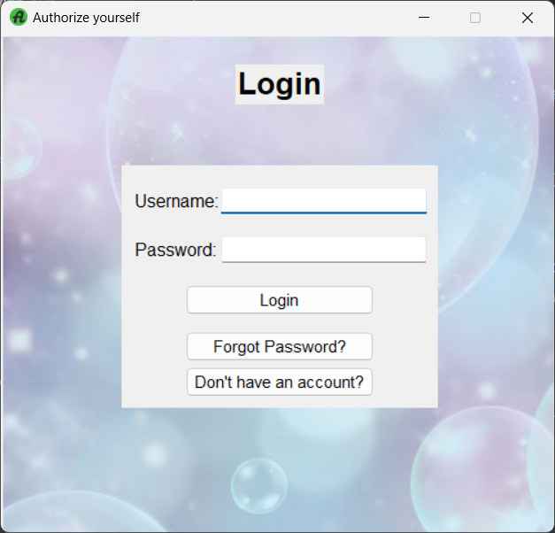
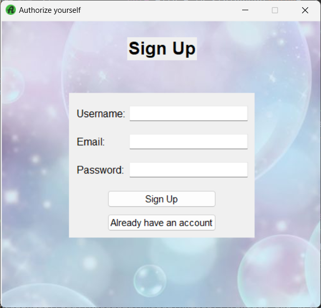
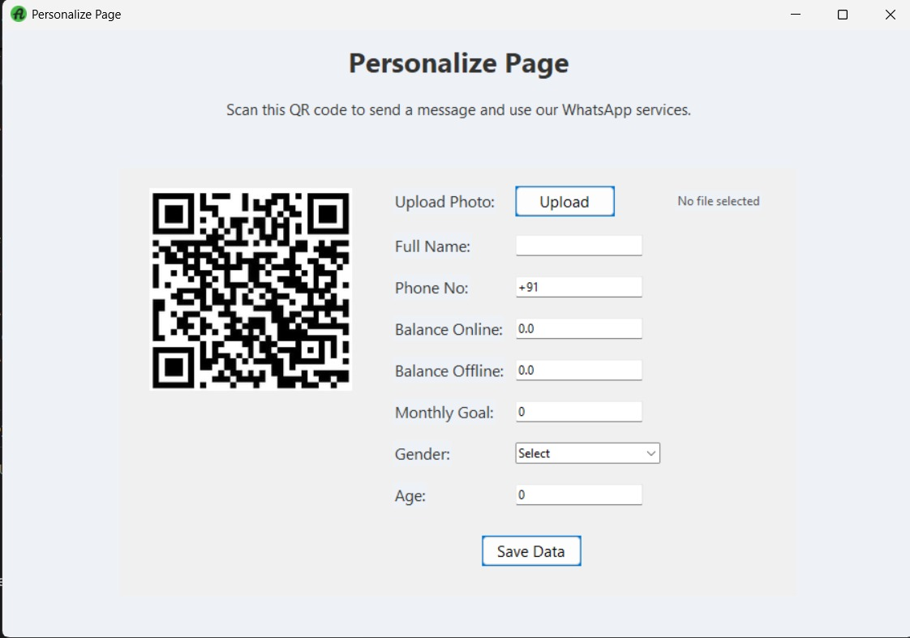
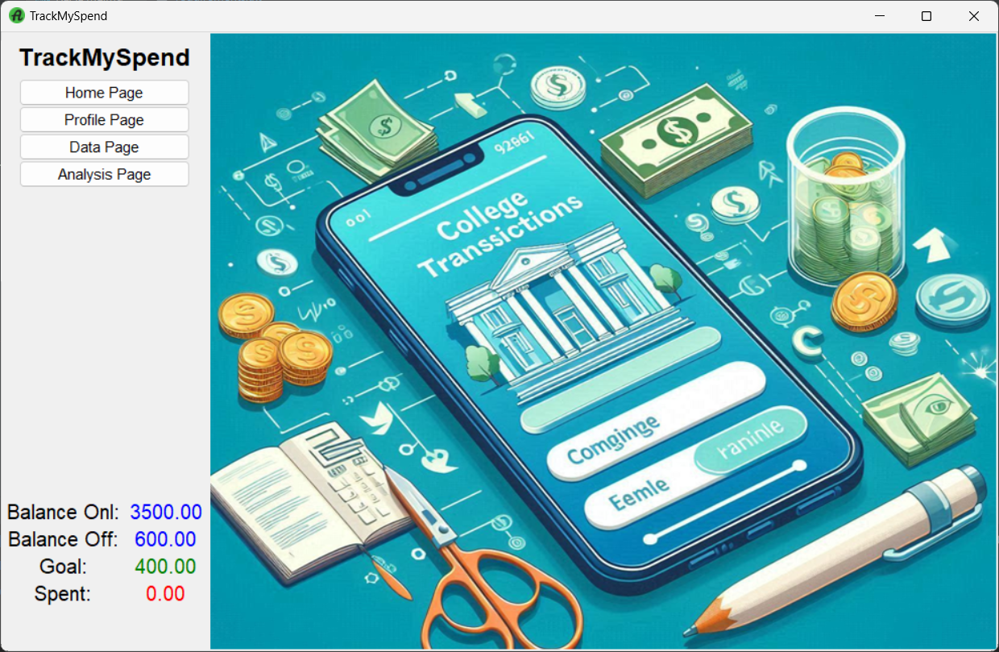
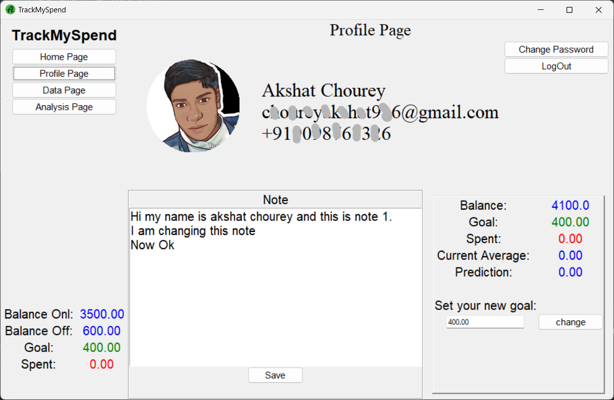
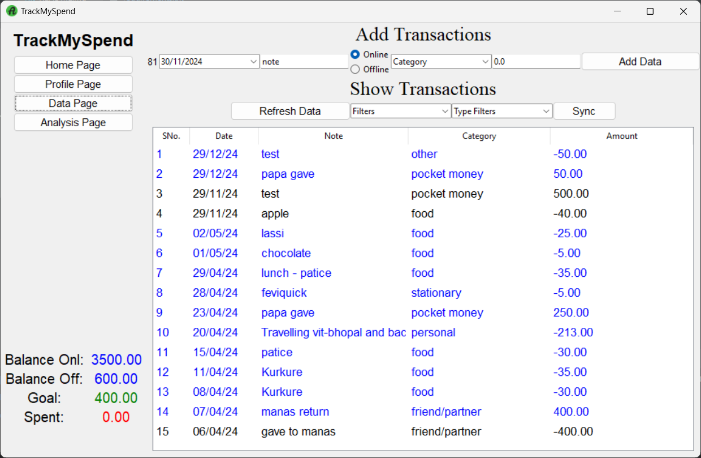
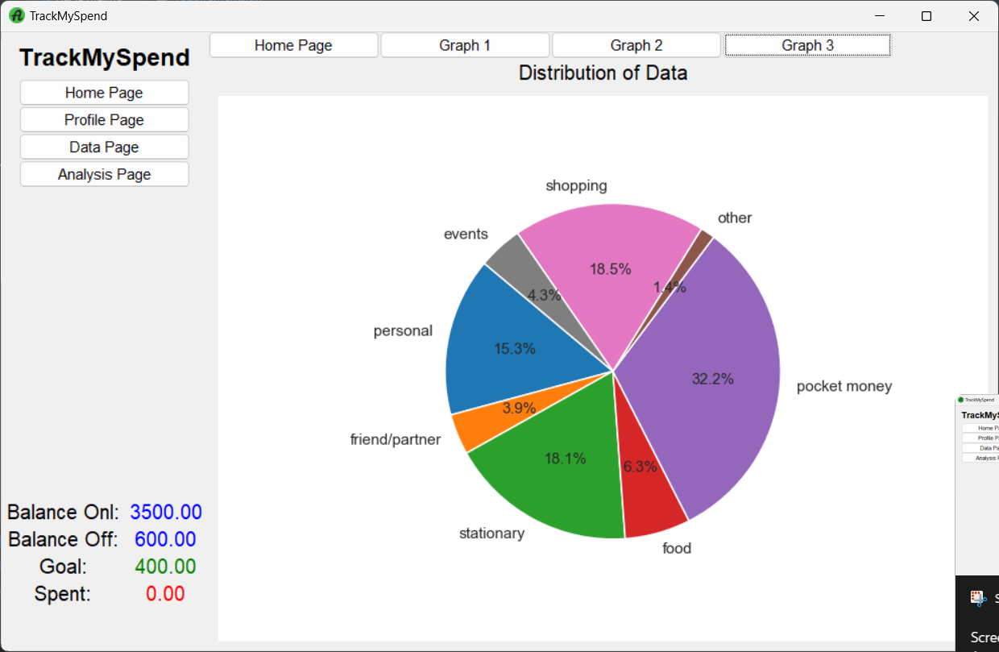

# TrackMySpend

### Problem Statement:
The problem of overspending is generally faced by college students 
resulting in their empty bank accounts and even finding it difficult to track 
their spending(how much they have spent on what). This overspending problem 
is further increased after the launch of digital payment systems like UPI.

### Overspending:
Overspending is the act of spending more money than one can afford. 
It results in empty bank accounts. Not knowing where you have spent.
Can affect your physical and mental health, it is very important to find the solution.

### Conclusion:
Any student using this application can tell how much they have 
spent in 4 years of their college journey.

### Before downloading keep this thing in mind that you will be needing a .env file in 'app' folder which you can get from:
[Download.env](https://drive.google.com/drive/folders/18nAlaC-MjI7LVTJ2bTpH14qzXZ9NkrDb)

## Download latest release:- 
Follow setup instructions 1 or 2
(only for programmers)

## Setup Instructions(1):-
1. Download zip file (green button) and unzip it.

2. Open unzipped file and to app folder.

3. Install all the required modules one by one in your command prompt:
   ```sh
   pip install tk tkcalendar pillow pymysql smtplib numpy pandas seaborn matplotlib dotenv python-dotenv cryptography

4. Run the application "main.py" normally.

## Setup Instructions(2):-
1. Clone the repository:
   ```sh 
   git clone git@github.com:Akshatchourey/Project-Exhibition-1-VITB.git
   cd Project-Exhibition-1-VITB
   
2. Install the dependencies:
   ```sh
   pip install -r requirements.txt
   
3. cd to desired folder:
    ```sh
   cd project Exhibition 1 VITB
   cd app
   
4. Run the application:
   ```sh
   python main.py

## Thank you.

## Few Screenshots:
### Authorization Pages
 
### Personalize Page

### Home Page

### Profile Page

### Data Page

### Analysis

